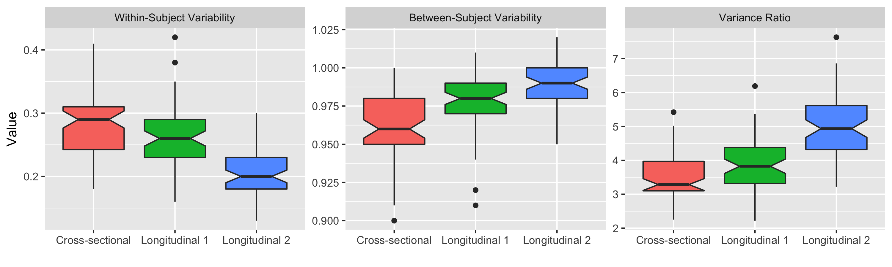
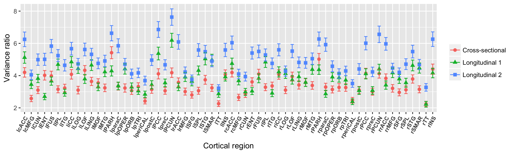
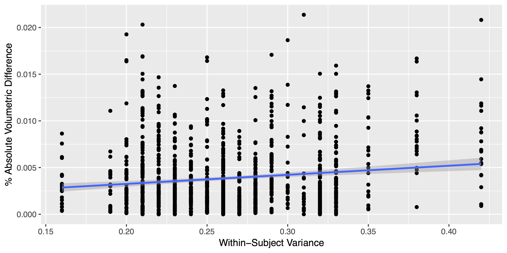
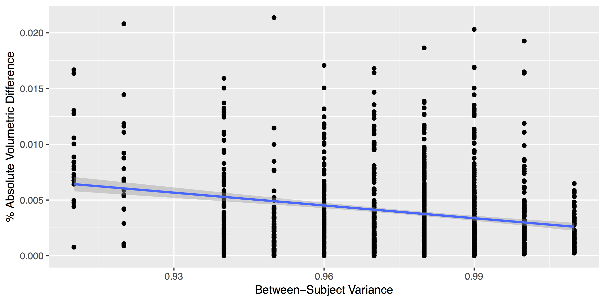

## Statistical methods

We used a simple statistical principle to compare performance between
cross-sectional and longitudinal processing methods.  We said that one
processing method outperforms the other when it does a better job minimizing
within-subject variability and maximizing between-subject variability in
cortical thickness measurements.  Such a quality implies greater
within-subject reproducibility while distinguishing between patient
subpopulations. As such this will amount to higher precision when
cortical thickness is used as a predictor variable or model covariate in
statistical analyses upstream. This criterion is immediately assessable
in terms of estimates associated to the longitudinal
mixed-effects model \eqref{eq::lme1} outlined below.

Longitudinal mixed-effect (LME) models comprise a well-established and widely used
class of regression models designed to estimate cross-sectional and longitudinal
linear associations between quantities while accounting for subject specific
trends.  As such, these models are useful for the analysis of longitudinally
collected cohort data. Indeed, [@Bernal-Rusiel:2013aa] provide an introduction to the mixed-effects methodology in the context of longitudinal neuroimage data and compare it empirically to competing methods such as repeated measures ANOVA.
For more general, near comprehensive treatments of the subject matter, see [@verbeke2009linear] and [@fitzmaurice2012applied]. We claim that LME models are useful, not only for the analysis of longitudinal cohort data, but also for the comparison of techniques used
to obtain the data itself. By fitting simple LME models to the data
resulting from cross-sectional and longitudinal processing techniques,
we are able to make concrete such ideas as within-subject, between-subject,
and total variability in a way that [@reuter2012] only hint at in
their exposition of their longitudinal, FreeSurfer based methodology.

As previously noted we observed yearly cortical thickness measurements
from sixty-two separate regions of interest.  To assess the above
variability based criteria while accounting for changes that may occur through
the passage of time, we used a Bayesian LME model for parameter
estimation.  Let $Y^k_{ij}$ denote the $i^{th}$ individual's cortical
thickness measurement corresponding to the $k^{th}$ region of interest
at measurement $j$.  Under the Bayesian paradigm we utilized a model of
the form \begin{gather} Y^k_{ij} \sim N(\alpha^k_i + \beta^k t,
\sigma_k^2) \\ \nonumber \alpha^k_i \sim N(\alpha^k_0, \tau^2_k) \qquad
\alpha^k_0, \beta^k \sim N(0,10)  \qquad \sigma_k^2,  \tau_k^2 \sim
\mbox{Cauchy}^+ (0, 5) \end{gather}\label{eq::lme1} Specification of parameters in the
above prior distributions reflect commonly accepted diffuse priors.
$\tau^2_k$ represents the between-subject variance parameter, and
$\sigma^2_k$ represents the within-subject variance parameter.  For each
region, the quantity of interest is thus the ratio $r^k =
\frac{\tau^2_k}{\sigma^2_k}$.  This ratio is closely related to the
intraclass correlation coefficient [@bartko1976various]:
\begin{equation} \rho_I = \frac{\tau^2}{\tau^2 + \sigma^2}\ , \end{equation}
which is the temporally constant within-subject correlation of the
random intercepts model [@verbeke2009linear]. The posterior distribution of
$r^k$ was summarized via the posterior median. Where the posterior
distributions were obtained using Stan probabilistic programming
language [@carpenter2016stan].

For each processing method we performed sixty-two independent
regressions.  In order to compare results between methods, we considered
the quantity $\delta^k = r^k_l - r^k_c$ and $\delta^k_{norm} =
\frac{r^k_l - r^k_c}{r^k_l + r^k_c}$, denoting the variance ratio for
the longitudinal method minus that of the cross-sectional method and the
normed difference between ratios, respectively (cf Figure ??). Since a large $r^k$
implies a higher between-subject to within-subject variability ratio, a
positive estimate of $\delta^k$ that is large in magnitude implies that
the longitudinal processing method is preferable to the cross-sectional
method.  Conversely, a negative estimate that is large in magnitude
implies that the cross-sectional processing method is preferable to the
longitudinal method.

Finally, we used basic LME models and cortical thickness measurements of the entorhinal cortex to demonstrate how these variability criteria relate to potential scientific analyses. First, we used model \eqref{eq::lme1} to show that a greater ratio of between-subject to within-subject variability results in tighter confidence and credible intervals on the slope parameter $\beta$. This result indicates more confidence with respect to mean trends. Second, we showed that smaller within-subject variability corresponds to smaller prediction intervals when predicting a subject's cortical thickness levels at future visits. This is important when considering regional cortical thickness measures as candidate biomarkers.  Third, we extended model \eqref{eq::lme1} to include a term for AD diagnostic status and demonstrated that lower total variability corresponds to tighter confidence/credible intervals for cross-sectional effects. This corresponds to higher certainty when evaluating linear associations between quantities, such as cortical thickness and AD status.

## Effects of Interpolation on Thickness Results

Consistent with the heuristic cited in [@Reuter:2012aa] of "treat[ing] all
time points exactly the same", our original approach was to reorient all subject
time points to the subject-specific template to avoid any bias associated with
variations in head orientation.  Although this had an overall effect of increased between-subject
variance and decreased within-subject variance relative to cross-sectional processing,
there are several regions where this trend is reversed.  However, when each time
point was processed in its native space, there was no such trend reversal, i.e.
all regions for this longitudinal pipeline variant showed better ratio measurements
than both cross-sectional and reorientation-to-the-SST longitudinal processing.

Consistent with other studies that have demonstrated the detrimental effects of interpolation
(e.g., [@Yushkevich:2010aa]), we discovered that the interpolation associated with reorientation
to the SST adds a source of noise to the anatomical characteristics associated with thickness
and that this artificial change in anatomical geometry correlates regionally with both the
within-subject and between-subject variance measurements described above.  

To explore these effects in greater detail, we

This trend is illustrated in
Figures XX (within-subject variance) and YY (between-subject variance).

