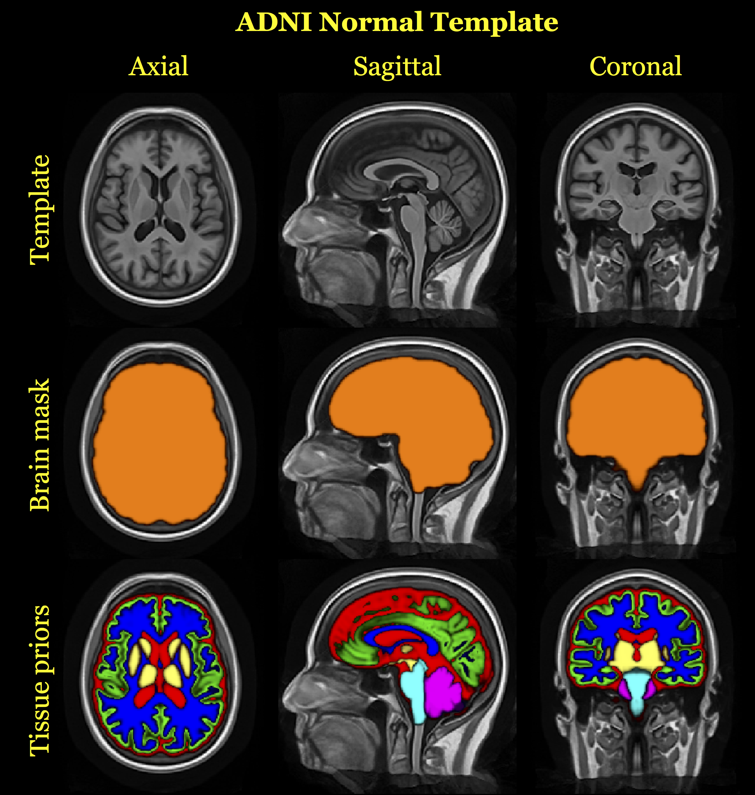

---
output:
  word_document:
    fig_caption: true
  pdf_document:
    fig_caption: true
    latex_engine: xelatex
    keep_tex: yes
  html_document:
    toc: false
header-includes:
   - \usepackage{booktabs}
   - \usepackage[final]{changes}
   - \usepackage[font={small},labelfont=bf,labelsep=colon]{caption}
   - \linespread{1.2}
   - \usepackage[compact]{titlesec}
   - \usepackage{enumitem}
   - \usepackage{tikz}
   - \def\checkmark{\tikz\fill[scale=0.4](0,.35) -- (.25,0) -- (1,.7) -- (.25,.15) -- cycle;}
   - \setlist{nolistsep}
   - \setremarkmarkup{(#2)}
bibliography: references.bib
csl: national-science-foundation-grant-proposals.csl
fontsize: 11pt
mainfont: Georgia
geometry: margin=1.0in
---

```{r setup, include=FALSE}
knitr::opts_chunk$set( cache=TRUE )
```

\pagenumbering{gobble}


\vspace{6 cm}

\begin{centering}

\LARGE

{\bf An open-science ADNI study using the ANTs longitudinal cortical thickness pipeline}

\vspace{1 cm}

\large
Nicholas J. Tustison$^{1,2}$,
Andrew J. Holbrook$^3$,
Jared M. Roberts$^2$,
Brian B. Avants$^4$,
James R. Stone$^1$,
Daniel L. Gillen$^3$, and
Michael A. Yassa$^2$

\vspace{0.5 cm}

\small

$^1$Department of Radiology and Medical Imaging, University of Virginia, Charlottesville, VA

$^2$Department of Neurobiology and Behavior, University of California, Irvine, Irvine, CA

$^3$Department of Statistics, University of California, Irvine, Irvine, CA

$^4$ Biogen, Cambridge, MA

\end{centering}


\vspace{5 cm}

\normalsize

Corresponding author: \
Nicholas J. Tustison \
4173 Cardamon Circle \
Corona, CA  92883 \
540-383-2719 \
ntustison@virginia.edu \


### Notes for discussion

* change the title?

* ordering of authors?

* other people to include?


\clearpage

# Abstract


Contributions:

* introduction of ANTs longitudinal cortical thickness pipeline

* Does longitudinal processing provide benefits over individual processing?

* availability ADNI1 and ADNI2 longitudinal and cortical thickness .csv files

* statistical methodology (R scripts availablility?)

* ADNI template (Toga?)


\clearpage

<!--

You can add internal comments which will not be reproduced using html comment delimiters.

-->

# Introduction

Quantification of brain morphology has proven invaluable in studying conditional
abnormalities such as Huntington's disease [@rosas2002;@rosas2005;@selemon2004],
schizophrenia [@nesvag2008], bipolar disorder [@lyoo2006],
Alzheimer's disease and frontotemporal dementia [@du2007,@dickerson2009],
Parkinson's disease [@jubault2011], Williams syndrome [@thompson2005],
multiple sclerosis [@ramasamy2009], autism [@chung2005,@hardan2006],
migraines [@dasilva2007], chronic smoking [@kuhn2010], alcoholism [@fortier2011],
cocaine addiction [@makris2008], marijuana use in adolescents [@Jacobus:2015aa],
Tourette syndrome in children [@sowell2008],
scoliosis in female adolescents [@wang2012],
heart failure [@Kumar:2015aa],
early-onset blindness [@jiang2009],
chronic pancreatitis [@frokjaer2012],
obsessive-compulsive disorder [@shin2007], ADHD [@almeida-montes2012], obesity [@raji2010],
and heritable [@peterson2009]
and elderly [@ballmaier2004] depression.  Evidence of cortical thickness
variation has also been found to be a function of age [@kochunov2011],
gender [@luders2006a], untreated
male-to-female transsexuality [@luders2012],  handedness
[@luders2006,amunts2007], intelligence [@shaw2006], athletic
ability [@wei2011], meditative practices [@lazar2005], musical ability [@bermudez2009,foster2010],
musical instrument playing [@Hudziak:2014aa],
tendency toward criminality [@raine2011],
childhood sexual abuse in adult females [@heim2013],
and Tetris-playing
ability in female adolescents [@haier2009].  Additionally,
connectivity studies demonstrate structural
relationships using cortical thickness measures
[@worsley2005,lerch2006,he2007,chen2008].

Large neuroimaging datasets such as those provided by the Alzheimer's
Disease Neuroimaging Initiative (ADNI) are increasing the importance
of fully automated and multiple modality brain mapping tools
[@Weiner2012].  The scale of such datasets will only increase over
time as international projects continue to build
large-scale neuroimaging data resources.  Currently, the
National Institutes of Health (NIH) also mandates that any NIH-funded data
resources, including MRI, must be released to the public.  In contrast
to ADNI, which provides standardized data acquisition protocols used
across all sites, these smaller-scale projects are collected in an
unstructured way.  Therefore, neuroimage processing tools must
reliably quantify even when there is a relative lack of quality
control over the input data.  While robustness is a goal shared by all
software development targeted at neuroscience, very few methods have
been thoroughly tested on large and unstructured neuroimaging datasets.


# Materials and Methods

## Imaging

## Cortical thickness

### Single time point processing

In [@Tustison:2014ab] we introduced the ANTs cortical thickness processing
pipeline using a large cohort of $\sim$ 1200 images taken from four popular, publicly
available data sets with ages ranging from 4 to 97 years.  The processing pipeline
comprises the following four major steps (cf Figure 1 of [@Tustison:2014ab]):

* N4 bias correction [@Tustison:2010ac],
* brain extraction [@avants2010a],
* Atropos six-tissue segmentation [@Avants:2011aa], and
* cortical thickness estimation [@das2009]

which is enhanced by the use of optimal shape and intensity templates derived
from the specific populations of study.  Regional statistics were quantified by
parcellating the cortex using a collection of 20 atlases from the OASIS test-retest
data which were labeled using
the Desikan-Killiany-Tourville (DKT) protocol [@Klein:2012aa] consisting of
31 labels per hemisphere (see Table 1).  Consensus labelings
in each subject were generated from the joint label fusion approach of [@Wang:2013ab].
A thickness-based evaluation with the well-known FreeSurfer algorithm demonstrated
better predictive performance of age and gender.  Since the original publication, we
have added multi-modal capabilities and the optional inclusion of patch-based denoising
based on an ANTs implementation
of the patch-based denoising algorithm of [@Manjon:2010aa].
The resulting regional statistics (including cortical thickness, surface area [@Lehmann:2012aa],
volumes, and Jacobian determinant values) were posted online
(https://github.com/ntustison/KapowskiChronicles).  These include the corresponding
FreeSurfer measurements which are also publicly available for research
studies (e.g., [@Hasan:2016aa]).
Since publication, this pipeline has been used in a number of cross-sectional studies
[@Price:2015aa;@Wisse:2015aa;@Betancourt:2015aa].

\input{dktRegions.tex}

### Unbiased longitudinal processing

![The ANTs longitudinal cortical thickness pipeline.  The original T1-weighted images
are used to generate an unbiased single-subject template (SST).  The SST is then
processed via the segmentation portion of the ANTs cross-sectional cortical thickness
pipeline reported in [@Tustison:2014aa] using the group template and tissue priors.
This results in a probabilistic estimate of the
CSF and the brain mask.  Joint label fusion (JLF) of 20 atlases involving six labels (CSF, gray
matter, white matter, deep gray matter, brain stem, and cerebellum) is used to get a
probabilistic estimate of the six tissues.  The latter five JLF probabilistic tissue
estimates are used as the SST prior probabilities whereas the CSF SST prior probablity
is derived as a combination of the JLF and segmentation CSF estimates, i.e.,
$P(CSF) = \max\left( P_{Seg}(CSF), P_{JLF}(CSF) \right)$.  The T1-weighted image at each
time point is rigidly aligned to the template and processed through original cortical
thickness pipeline using the SST template and auxiliary images
(brain extraction mask and tissue priors).  Cortical labelings obtained using JLF are
then used to quantify ROI-based statistics.](../Figures/longitudinalPipeline.png)

_Overview._ See Figure 1.  The ANTs longitudinal cortical thickness pipeline extends the ANTs cortical
thickness pipeline for longitudinal studies which takes into account various bias issues
which have been discussed in the literature [@Yushkevich:2010aa,@Reuter:2011aa,@Reuter:2012aa].
Prior to the processing of any individual subjects a group template [@Avants:2010aa] and
corresponding auxiliary images (i.e., six-tissue and brain extraction prior probability
maps) are generated. This cohort is typically composed of a subset of the study subjects.

Following the offline construction of the group template and prior probabability images,
each subject undergoes similar processing.  First, an average shape and intensity single
subject template (SST) is created from all time point images [@Avants:2010aa].  Each
time point image is then rigidly aligned to the SST.  The SST prior probablity maps are
created using a protocol combining brain extraction and a six-tissue segmentation and
a six-label joint label fusion processing of the SST.  After the SST template priors are
created, each time point image is rigidly aligned to the template to reduce the
effect of coordinate system or interpolation bias.

Each rigidly-aligned time point image is processed using the ANTs original pipeline
and the SST template and template priors resulting in a brain extraction mask, six-tissue
segmentation, and a cortical thickness map for each time point image.  The cortical ROIs
from the DKT atlases are propogated to each time point using a "pseudo-geodesic" mapping
and joint label fusion.


Subsequent processing segments
the SST into six probabilistic tissues classes:   cerebrospinal
fluid (CSF), gray matter (GM), white matter (WM), deep gray matter (striatum + thalamus),
brain stem, and cerebellum.  This requires processing the SST through two parallel workflows.  First,
the SST proceeds through the standard ANTs cortical thickness pipeline which generates
a brain extraction mask and the CSF posterior probability map.  Second, using
a data set of expert annotations [@Klein:2012aa], a class-leading multi-atlas joint label fusion step [@Wang:2013ab] is performed to
create individualized probability maps for all tissue types.  This final version of the SST enables
unbiased mappings to the group template, subject-specific tissue segmentations, region of interest volumes and
cortical thickness maps for each of the original time series images.
The corresponding cortical labelings (generated
using a multi-atlas label fusion approach and a selected cortical parcellation protocol)
are then used to tabulate regional thickness and area values for statistical analysis.
Other modalities are then mapped to the group template through these unbiased
transformations, as in [@Tustison:2014aa;@Avants:2015aa]



_ADNI normal template._

_"Cooking" the template priors._

_Pseudo-geodesic for large cohort labeling._


__\textcolor{red}{Notes to self:}__

* \textcolor{red}{Add an image and discussion of the pseudo-geodesic for facilitating malf-labeling.}

* \textcolor{red}{Discuss the ants implementation (multi-threading, etc.)}

* \textcolor{red}{Discuss ADNI template}


## Statistical methods

We used a simple statistical principle to compare performance between
cross-sectional and longitudinal processing methods.  We said that one
method outperforms the other when it does a better job minimizing
within-subject variability and maximizing between-subject variability in
cortical thickness measurements.  Such a quality implies greater
within-subject reproducibility while distinguishing between patient
subpopulations. As such this will amount to higher precision when
cortical thickness is used as a predictor variable or model covariate in
statistical analyses upstream. This criterion is immediately assessable
in terms of estimates associated to the longitudinal
mixed-effects model outlined below.

As previously noted we observed yearly cortical thickness measurements
from sixty-two separate regions of interest.  To assess the above
variance criterion while accounting for changes that may occur through
the passage of time, we used a hierarchical Bayesian model for parameter
estimation.  Let $Y^k_{ij}$ denote the $i^{th}$ individual's cortical
thickness measurement corresponding to the $k^{th}$ region of interest
at measurement $j$.  Under the Bayesian paradigm we utilized a model of
the form \begin{gather} Y^k_{ij} \sim N(\alpha^k_i + \beta^k t,
\sigma_k^2) \\ \nonumber \alpha^k_i \sim N(\alpha^k_0, \tau^2_k) \qquad
\alpha^k_0, \beta^k \sim N(0,10)  \qquad \sigma_k^2,  \tau_k^2 \sim
\mbox{Cauchy}^+ (0, 5) \end{gather} Specification of parameters in the
above prior distributions reflect commonly accepted diffuse priors.
$\tau^2_k$ represents the between-subject variance parameter, and
$\sigma^2_k$ represents the within-subject variance parameter.  For each
region, the quantity of interest is thus the ratio $r^k =
\frac{\tau^2_k}{\sigma^2_k}$.  This ratio is closely related to the
intraclass correlation coefficient [@bartko1976various].  The posterior distribution of
$r^k$ was summarized via the posterior median. Where the posterior
distributions were obtained using Stan probabilistic programming
language [@carpenter2016stan].

For each processing method we performed sixty-two independent
regressions.  In order to compare results between methods, we considered
the quantity $\delta^k = r^k_l - r^k_c$ and $\delta^k_{norm} =
\frac{r^k_l - r^k_c}{r^k_l + r^k_c}$, denoting the variance ratio for
the longitudinal method minus that of the cross-sectional method and the
normed difference between ratios, respectively (cf Figure ??). Since a large $r^k$
implies a higher between-subject to within-subject variability ratio, a
positive estimate of $\delta^k$ that is large in magnitude implies that
the longitudinal processing method is preferable to the cross-sectional
method.  Conversely, a negative estimate that is large in magnitude
implies that the cross-sectional processing method is preferable to the
longitudinal method.


# Results


# Discussion


## Subsection 1

And a sweet equation:

$$ \exp^{-i \pi} = -1 $$


\clearpage

# References
